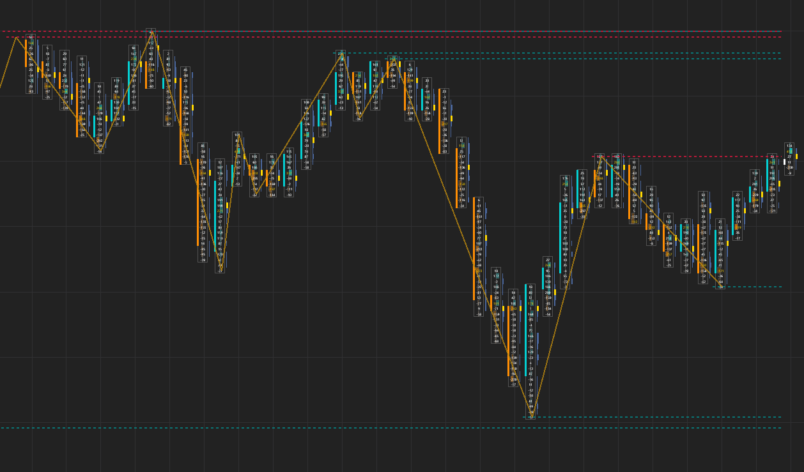

# Open Auto Trend Support Resistance

    

Open Auto Trend Support Resistance displays the trend line, support and resistance levels based on the high and low pivots. The lines are checked at the first tick of each bar and will automatically draw the lines.

For usage, you can download the zip containing the word import in the release page. You can import this zip file similar to importing a normal NinjaTrader Add-On. https://github.com/WaleeTheRobot/open-auto-trend-support-resistance/releases

# Properties

- Right Offset - The offset for the lines from the right.
- Required Ticks for Broken - The required ticks consider a level broken.
- Display Trend Line - Enable to display the trend line.
- Display Levels - Enable to display the support and resistance levels.
- Trend Line Color - The color for the trend line.
- Level Line Color - The color for the support and resistance levels.
- Test Level Line Color - The color for the tested support and resistance levels.
- Trend Line Opacity - The opacity for the trend line.
- Level Line Opacity - The opacity for the support and resistance levels.
