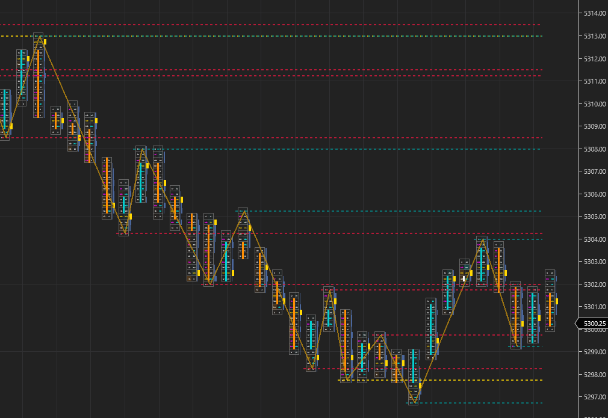

# Open Auto Trend Support Resistance

    

Open Auto Trend Support Resistance displays the trend line, support and resistance levels based on the high and low pivots. The lines are checked at the first tick of each bar and will automatically draw the lines.

For usage, you can download the zip containing the word import in the release page. You can import this zip file similar to importing a normal NinjaTrader Add-On. https://github.com/WaleeTheRobot/open-auto-trend-support-resistance/releases

You can also download it at NinjaTrader Ecosystem. It may take a few days for them to update to the latest version found here on GitHub. 
https://ninjatraderecosystem.com/user-app-share-download/auto-trend-support-resistance

# Properties

- Right Offset - The offset for the lines from the right.
- Required Ticks for Broken - The required ticks consider a level broken.
- Display Trend Line - Enable to display the trend line.
- Display Levels - Enable to display the support and resistance levels.
- Trend Line Color - The color for the trend line.
- Level Line Color - The color for the support and resistance levels.
- Test Level Line Color - The color for the tested support and resistance levels.
- Broken Level Line Color - The color for the broken support and resistance levels.
- Trend Line Opacity - The opacity for the trend line.
- Level Line Opacity - The opacity for the support and resistance levels.
- Lookback Period SR Levels - Untested, tested and broken pivot points will display back to this value. If zero, only untested and tested will display. Use this if you want to display all levels back to a certain amount of bars.
- Lookback Period Broken SR Levels - Broken pivot points will display back to this value. If zero, no broken levels will display. Use this if you want to display broken levels back to a certain amount of bars, but still want to show all the untested and tested levels.

# Issues

Sometimes NinjaTrader will complain about an import failed. You can just open the zip file from the release and copy the `OpenAutoTrendSupportResistance` file into the Indicators folder on your computer after removing the previous file. It's normally located at: `C:\Users\<username>\Documents\NinjaTrader 8\bin\Custom\Indicators`. Afterwards, open NinjaTrader and click `New` > `NinjaScript Editor`. Click the NinjaScript Editor and press `F5`. It'll take a few seconds and you'll hear a sound. The icon at the bottom left corner of it will disappear when it's done compiling. Close the NinjaScript Editor and you should be good to go.
